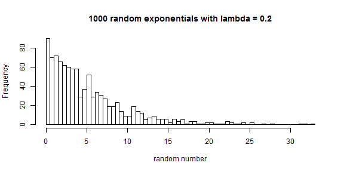
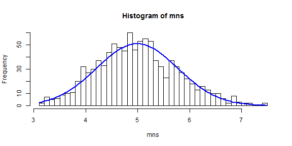

## Slide 1

Investigate the exponential distribution and compare it with the Central Limit Theorem.

In the following investigations we assume an exponetially distributed random variable X with lambda = 0.2. Both expectation value and standard deviation of this distribution have the value 1/lambda, i.e. E[X] = 5 = sigma, Var(X) = 25.

--- .class #id 

## Slide 2

At first we would like to get a clue what the distribution looks like.
Let's simulate 1000 random variables and have a look at the histogram.

```r
lambda <- 0.2
nsim <- 1000
set.seed(1)   #necessary to reproduce identical results
hist(rexp(nsim, lambda),50, main="1000 random exponentials with lambda = 0.2", xlab="random number")
```

 

We see a familiar picture resembling an exponentially decreasing function. But this was merely done to sketch the exponential distribution. 


---

## Slide 3

Now let's have a look at the behaviour of the mean of n of such random variables.

At first, simulate  n1 (40) random exponentials nsim (1000...as above) times and compute the means 
thus giving a vector of nsim numbers.


```r
set.seed(1)   #necessary to reproduce identical results
n1 <- 40 
mns = NULL
for (i in 1 : nsim) mns = c(mns, mean(rexp(n1, lambda)))
summary(mns)
```

```
##    Min. 1st Qu.  Median    Mean 3rd Qu.    Max. 
##   3.108   4.445   4.950   4.990   5.492   7.491
```

---

## Slide 4

The means should be normally distributed according to the CLT (Central Limit Theorem). 

At first let's sketch the distribution of sample averages via a histogram: 

```r
h <- hist(mns,50)
xfit<-seq(min(mns),max(mns),length=100) 
yfit<-dnorm(xfit,mean=mean(mns),sd=sd(mns)) 
yfit <- yfit*diff(h$mids[1:2])*length(mns) 
lines(xfit, yfit, col="blue", lwd=2) 
```

 
In addition the normal curve with corresponding parameters for expectation value and variance is shown.

---

## Slide 5

Expectation value should be like that of the original distribution (which has a value of 5).
So, what is the "mean of the means"?

```r
mean(mns)    #"mean of the means"
```

```
## [1] 4.990025
```

Yeah, pretty close to what we expected to see, isn't it?!
Secondly, compare the variance of the means to the "theoretical" variance of the original distribution, respectively the theoretical variance of the distribution of means with regard to the sample size (which is 25/40).
For this purpose we compute the sample variance and multiply with the sample size (i.e. 40).

```r
var(mns) * n1  
```

```
## [1] 24.44466
```
Well, I wouldn't say this is very far from the value 25.

